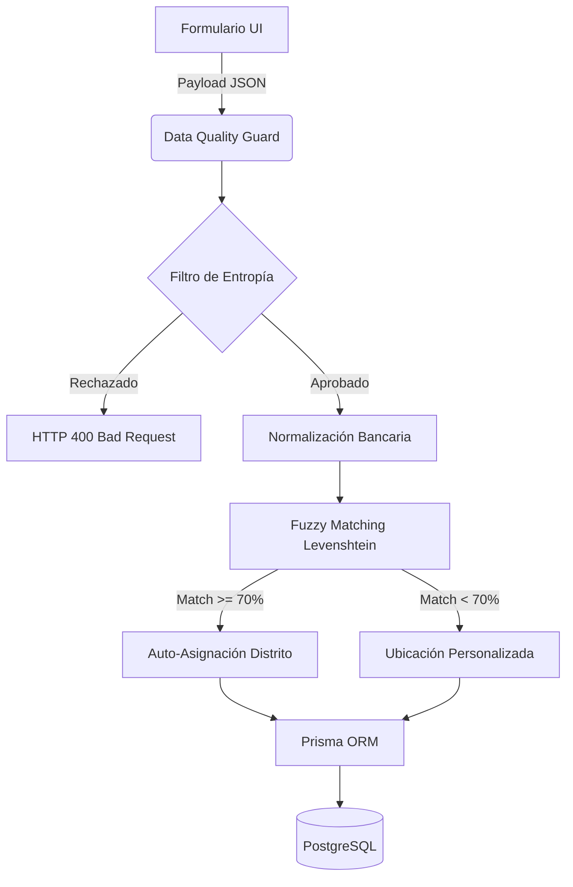

# Sistema de Gestión de Clientes Pro (SV 2026)

> **Documentación Técnica y Arquitectura de Soluciones**

Un sistema de gestión de clientes (SaaS) diseñado bajo los principios de **Gestión de Riesgos de Información** e **Integridad Estadística**. El proyecto abandona la captura de datos en texto plano en favor de un ecosistema fuertemente tipado, orquestado y resiliente, preparado nativamente para la transición administrativa territorial de El Salvador.

---

## 🏗️ 1. Arquitectura de Resiliencia

El sistema opera sobre un stack tecnológico moderno, garantizando alta disponibilidad y consistencia desde el momento del despliegue:

* **Core Framework:** Next.js (App Router) y React.
* **Capa de Persistencia:** PostgreSQL 15.
* **ORM:** Prisma (Type-Safe Database Access).
* **Orquestación:** Docker & Docker Compose.

**Resiliencia mediante Healthchecks Estrictos:**  
Para evitar *race conditions* (como intentar migrar una base de datos que aún no ha iniciado), el contenedor de la aplicación (`app_clientes`) cuenta con un bloqueo por dependencia lógica:
```yaml
depends_on:
  postgres:
    condition: service_healthy
```
Esto garantiza que la aplicación no inicie, ni ejecute migraciones o *seeding*, hasta que PostgreSQL responda afirmativamente a la prueba interna `pg_isready`.

---

## 🇸🇻 2. Geopolítica SV 2026 (Transición Administrativa)

La plataforma integra de forma nativa la nueva división política de El Salvador. Se reemplazó la entrada manual de texto por una **estructura relacional estricta**, asegurando la integridad estadística para cruces de datos y reportería:

| Nivel Jerárquico   | Cantidad | Implementación Arquitectónica                          |
| :---               | :---:    | :---                                                 |
| **Departamentos**  | 14       | Entidades inmutables precargadas en el *Seed*.         |
| **Municipios**     | 44       | Relación 1:N con los departamentos.                    |
| **Distritos**      | 262      | Relación 1:N con los municipios.                       |

**Ventaja Arquitectónica:** Al basar las ubicaciones en `UUIDs` referenciales en lugar de strings, el sistema previene la fragmentación del dato ("San Salvador" vs "Sn Salvador"), haciendo que las agrupaciones métricas sean 100% exactas.

---

## 🛡️ 3. Data Quality Guard (Asistente de Integridad)

Para garantizar la pureza del *Data Lake* relacional, se implementó un middleware inyectado en las rutas de creación y actualización (`src/app/api/clientes/guard.ts`). Este guardián procesa el *payload* antes de interactuar con Prisma:

### Flujo de Vida del Dato



### Mecanismos de Sanitización

1. **Normalización Bancaria:**  
   Transformación automática de todos los campos de texto a `MAYÚSCULAS` y eliminación de espacios redundantes. Garantiza un estándar visual institucional.
2. **Mitigación de Ruido (Entropía):**  
   Previene ingresos accidentales extremos (ej. `"asdfgh"`, pulsaciones del gato en el teclado). El algoritmo evalúa la existencia de vocales y bloquea secuencias de *5 o más consonantes continuas*. Se ajustó cuidadosamente para permitir nombres o palabras muy cortas sin afectar la flexibilidad del usuario.
3. **Fuzzy Matching Asistido (Levenshtein):**  
   Actúa como corrector ortográfico. Si un usuario envía un nombre de ciudad, el sistema calcula la Distancia de Levenshtein contra el catálogo en memoria. Si la similitud supera el umbral del **70%**, el sistema auto-corrige la cadena y la enlaza al `distritoId` oficial. De lo contrario, respeta el dato y levanta el *flag* `es_ubicacion_personalizada`.

---

## 📊 4. Motor de Reportería (CSV)

La exportación de datos (`src/app/api/clientes/export/route.ts` & `ClienteService.exportToCSV`) implementa una técnica de **Deep Relational Flattening**.

* **Despliegue de Jerarquía:** Prisma ejecuta una consulta profunda (`include`) que extrae la cadena completa: `Direcciones -> Distrito -> Municipio -> Departamento`.
* **Transformación Tabular:** Los objetos anidados en JSON se aplanan en columnas independientes de Excel (`DEPARTAMENTO`, `MUNICIPIO_2026`, `DISTRITO_2026`, `REF_PRIMARIA`, etc.).
* **Legibilidad:** Asegura que los administradores lean nombres de ciudades en mayúsculas en el CSV en lugar de identificadores alfanuméricos internos, simplificando las auditorías manuales.

---

## 🚀 5. Guía de Despliegue 360°

El sistema requiere cero configuración manual gracias a su arquitectura por contenedores.

### Pre-requisitos
Asegúrate de contar con el archivo `.env` en la raíz (puedes basarte en `env.example`).
```env
DB_USER=root
DB_PASSWORD=root
DB_NAME=db_clientes
DATABASE_URL="postgresql://root:root@db_clientes:5432/db_clientes?schema=public"
JWT_SECRET=tu_secreto_seguro
```

### Paso 1: Inicialización
Ejecuta el siguiente comando para orquestar la infraestructura. Esto levantará la base de datos, ejecutará migraciones, insertará los catálogos SV 2026 e iniciará la aplicación web y el túnel Zero Trust:

```bash
docker-compose up -d --build
```

### Paso 2: Extraer la URL de Acceso
El sistema se auto-expone a internet de forma segura mediante Cloudflare. Extrae la URL dinámica inspeccionando los logs del túnel:

```bash
docker logs tunnel_clientes
```
*Busca la línea que contiene `https://*.trycloudflare.com`.*

### Paso 3: Acceso al Sistema
Ingresa al enlace generado y autentícate con las credenciales maestras aprovisionadas por el *seed*:

* **Usuario Administrativo:** `admin`
* **Contraseña:** `adminpassword`
